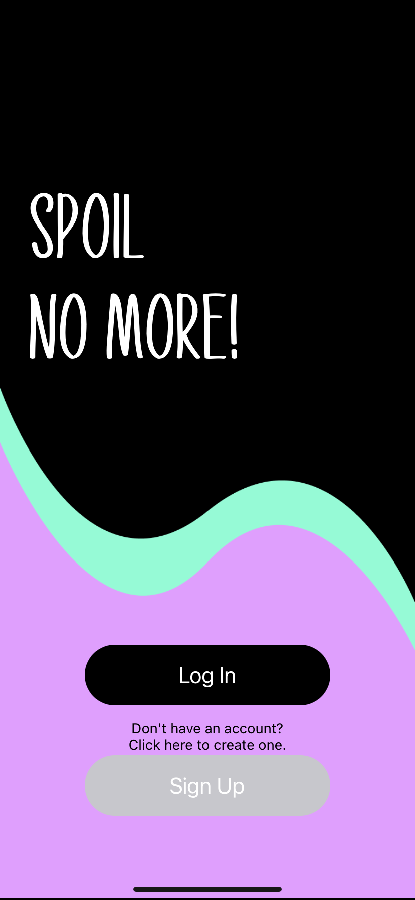
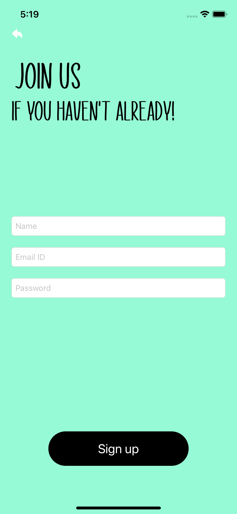
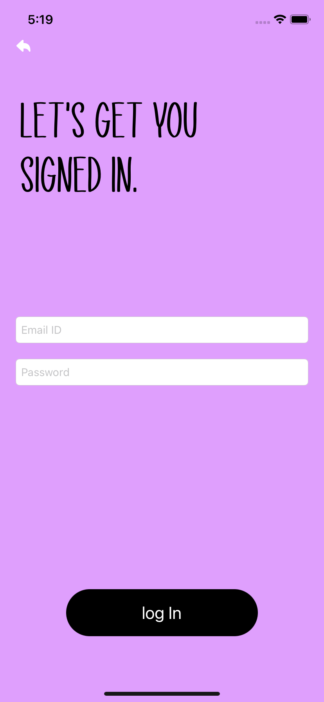
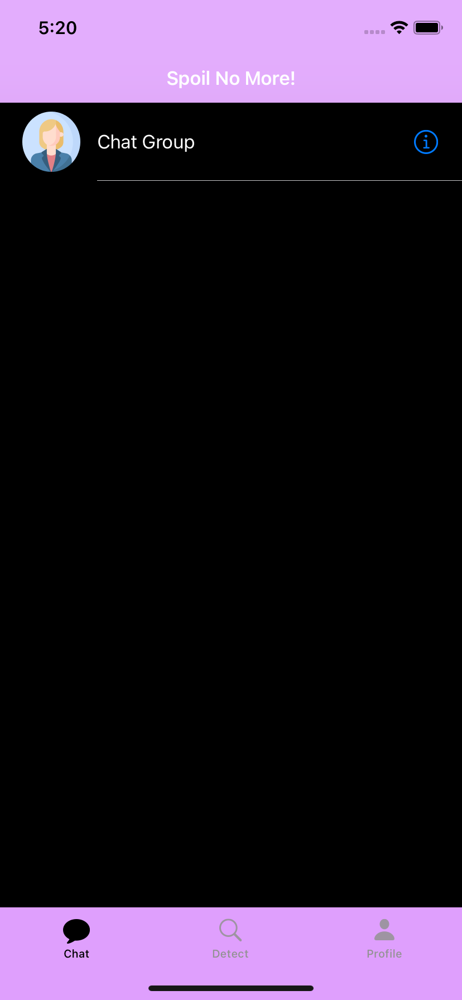
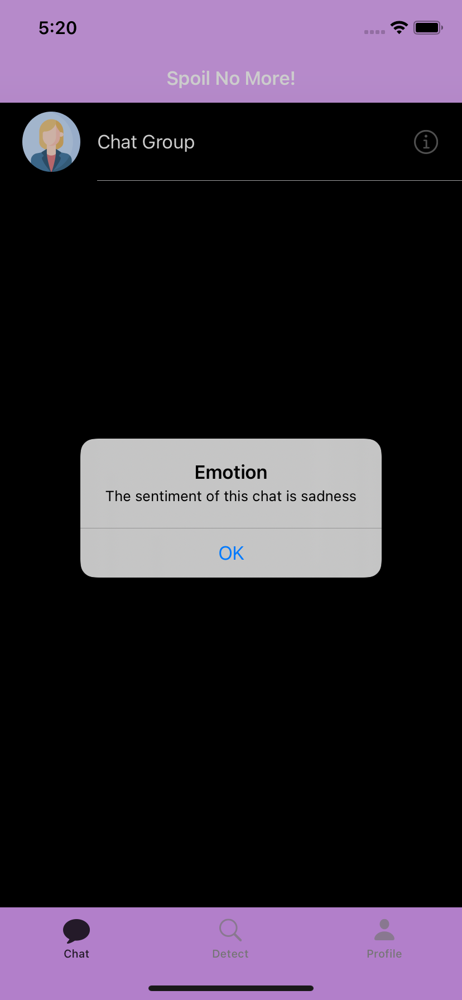
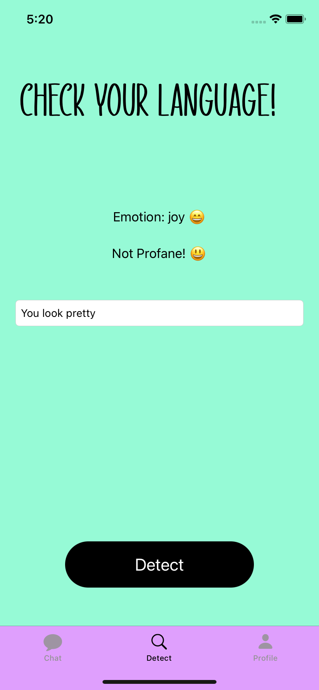
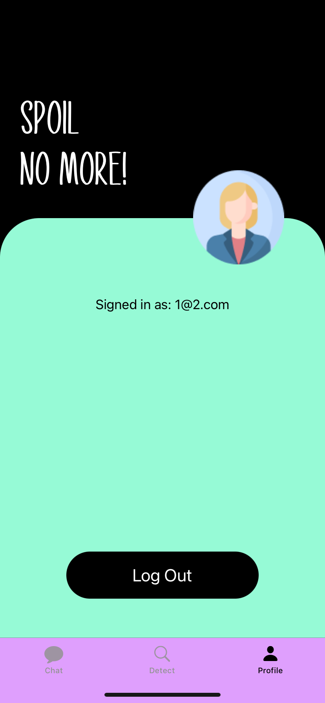
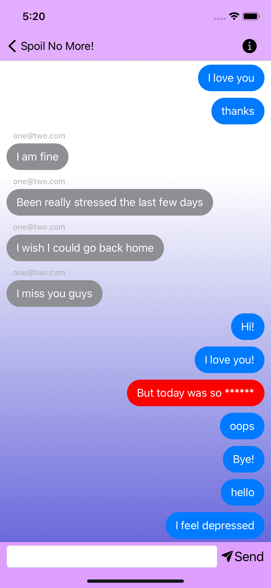
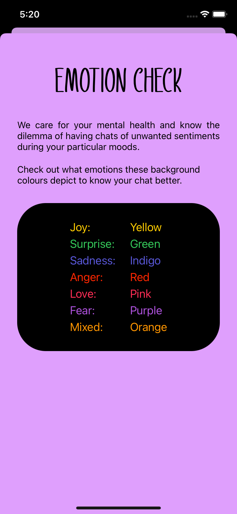

<h1 align="center"> Spoil No More! </h1> 

 

## Table of Contents

- [Motivation](#motivation)
- [Introduction](#introduction)
- [Features](#features)
- [Steps to Run](#steps-to-run)
- [How to Use](#how-to-use)
- [Libraries Used](#libraries-used)
- [App Screenshots](#app-screenshots)
- [License](#license)
- [Author](#author)
- [Acknowledgments](#acknowledgments)

<!-- END doctoc generated TOC please keep comment here to allow auto update -->

## Motivation

Social media, and the conversations we have on them often affect our mental health. They bother children and adults alike. Sometimes they might contain abusive and profane words and make us feel bad. Even if they are not profane, chats of a particular sentiment may affect us negatively at different times. Hence, after brainstorming to find solutions to this problem, we came up with our idea of this project. 

## Introduction

'Spoil No More' lets the users control their mental health themselves by letting them choose what conversations to enter based on their sentiments. It also prevents the spread of abusive language and can be a very essential app for kids as well as online education. It is aimed to make chatting harrassment-free and in accordance to your moods.

## Features

A few of the things you can do with 'Spoil No More':

* Make an account and chat with your friends
* Detect profanity of your own phrases
* Check the emotion of your phrases
* Get to know the emotion of an ongoing chat without opening it
* Avoid being affected by abusive words that our censored by us
* Analyse the emotion of a chat you are present in through our customised emotion-colour backgrounds.

## Steps to Run

* Clone or download the app from this repository. 👩‍💻
 * Open project file in terminal. 💻
 * Run `pod intall` to install all dependencies. 📥
 * Install the swift package `IQKeyboardManager`.
 * Open the `safechat.workspace` file. 💾
 * Change the bundle identifier. ⚙️
 * Press `Ctrl + R` to run the app. 📲
 
## How to Use

* Create an account and Sign Up if you haven't already.
* If you have an account, Sign In using your email and password.
* Once you land on the chat list screen, tap the detail button to know to emotion of the current ongoing chat.
* Tap on the Chat to open it.
* Type and press send to send your messages.
* Observe the background changing in accordance to the sentiment of your recent chats. 
* Tap the info button to learn more about the emotion-based color background.
* Go back from the chat using the back button
* To check the profanity and emotion of your text or any random phrase, do check our `detect` tab.
* To check account details like mail id or log out, go to `profile` tab.

* Text email: 1@2.com,
* Test password: 123456
 
## Libraries, Packages and Technologies Used

* UIKit
 * Firebase
 * CreateML
 * IQKeyBoardManager
 * Prompt API - Bad Words Censor
 
## App Screenshots

 
 
 
 
 
 
 
 
 
 

## License

Please read the [LICENSE](../main/LICENSE) file for details.

## Author

[Swamita Gupta](https://github.com/swamita-gupta)

## Acknowledgments

The dataset used to create model through createML is [Emotion Detection for NLP](https://www.kaggle.com/praveengovi/emotions-dataset-for-nlp).
